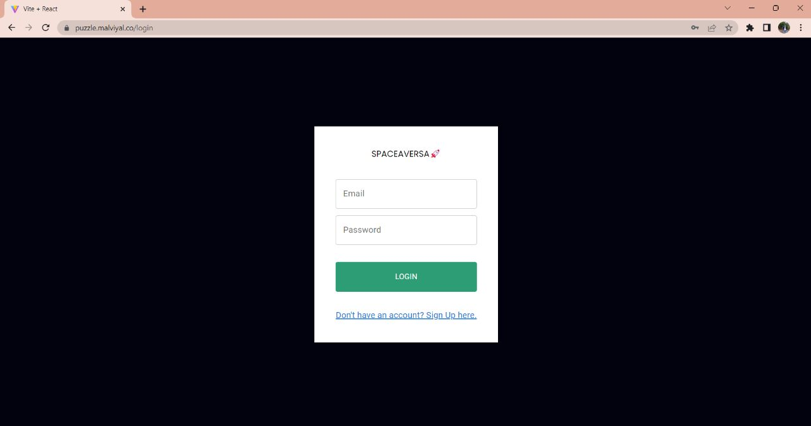
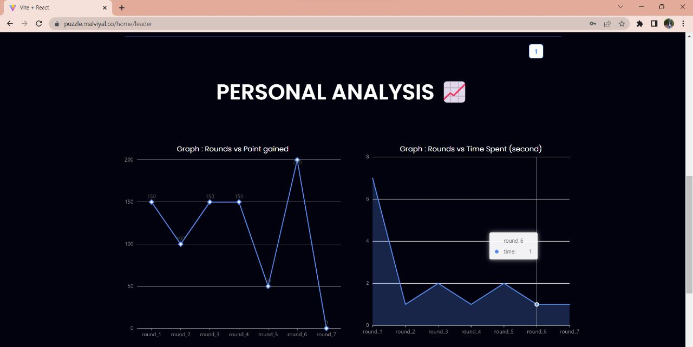
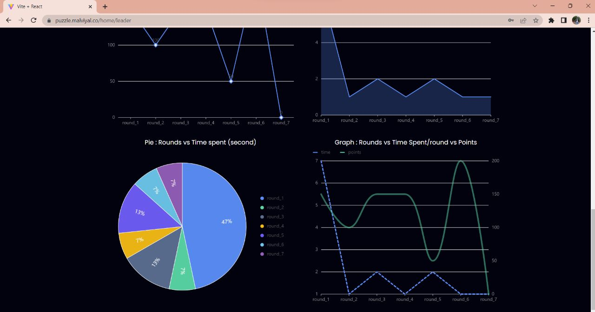

<h1>Spaceaverse Game</h1>
Spaceaverse is a collection of seven different games that are designed to challenge and entertain players. Each game assesses a different set of soft skills, including problem-solving, critical thinking, and strategic planning.

<h3>Games</h3>
1. <b>15 Puzzle</b> 
    The 15 Puzzle is a classic game where you need to rearrange the numbered tiles in order to put them in numerical order. The game assesses a player's problem-solving and strategic thinking skills.

2. <b>Magic Match Card</b> 
    Magic Match Card is a memory game where players have to match pairs of cards. The game assesses a player's memory and cognitive skills.

3. <b>Tower of Hanoi</b> 
    The Tower of Hanoi is a classic game where you need to move a tower of disks from one peg to another, following certain rules. The game assesses a player's problem-solving and strategic thinking skills.

4. <b>Tenzies</b> 
    Tenzies is a dice game where players need to roll the dice until they are all the same number. The game assesses a player's probability and luck.

5. <b>Find the Difference between Images</b> 
    In this game, players are presented with two seemingly identical images and they have to spot the differences between them. The game assesses a player's attention to detail and visual perception.

6. <b>Wordle</b> 
    Wordle is a word-guessing game where players have to guess a five-letter word in as few attempts as possible. The game assesses a player's vocabulary and deductive reasoning skills.

7. <b>2048</b> 
    2048 is a number game where players slide numbered tiles on a grid to combine them and create a tile with the number 2048. The game assesses a player's problem-solving and strategic thinking skills.

<h2>Game Features</h2>
<ul>
    <li>Seven rounds of different games to keep players engaged and entertained</li>
    <li>Eight soft skills assessed, including problem-solving, memory, and critical thinking</li>
    <li>Seven dead-ends to add an element of challenge to the game</li>
    <li>User leaderboard to track progress and compare scores with other players</li>
    <li>Admin panel for overall analytics and management</li>
    <li>User analytics available after game ends for personal progress tracking</li>
    <li>Authentication</li>
    <li>Spaceaverse has a built-in authentication system that allows users to sign up, sign in, There is also an admin login for game analytics.</li>
</ul>

<h3>Authorization</h3>
    Only logged-in users can play the game and access the user leaderboard and result analysis. Only the admin can access the admin panel for overall analytics and management.
<h3>Screenshots</h3>

        
         
        Entry Page
          
        
         
        signup page
          
        
         
        Login page
          
        
         
        Admin Login
          
        
         
        Admin Result page
          
        
         
        User Result page 1
         
         
        
         
        User Result page 1
          

<h2>Detailed View of the Game</h2>
Completion of the Game
To complete the game, players need to make their way through all seven rounds, earning points and improving their soft skills along the way. At the end of the game, players can view their personal analytics to track their progress and see how they performed in each round.

<h2>General Instructions for the Game</h2>
Each game has its own set of instructions that are displayed before the game begins. Players can refer to these instructions if they need help understanding the rules of the game.

<h3>Rounds</h3>
<h4>Round 1: 15 Puzzle</h4>
 In this classic sliding puzzle game, you have to slide the tiles around to put them in numerical order from 1 to 15. Sounds easy enough, right? But as you slide the tiles, you'll quickly find that it's harder than it looks. With each move, you'll have to carefully consider the placement of each tile to make sure you don't get stuck.

<h4>Round 2: Magic Match Card</h4>
 In this memory game, you'll be shown a grid of cards with various symbols on them. Your goal is to flip over pairs of cards to find the matching symbols. But be careful - the cards will be shuffled after each turn, so you'll need to remember where you saw each symbol in order to make matches and score points.

<h4>Round 3: Tower of Hanoi</h4>
 In this classic puzzle game, you'll be given a stack of disks of different sizes and three pegs. Your goal is to move the entire stack to another peg, obeying the following simple rules: only one disk can be moved at a time, and no disk can be placed on top of a smaller disk. As you progress through the levels, the number of disks will increase, making the game more challenging.

<h4>Round 4 : Tenzies</h4>
 This simple but addictive game involves rolling a set of dice until all the dice show the same number. Each turn, you can choose which dice to keep and which to roll again, trying to get all of them to match. The game is over when all the dice show the same number.

<h4>Round 5 : Find the Difference between Images</h4>
 In this game, you'll be shown two seemingly identical images and your goal is to find the differences between them. Some differences will be obvious, while others may be more subtle. You'll need to use your powers of observation and attention to detail to find all the differences before time runs out.

<h4>Round 6 : Wordle</h4>
 In this word-guessing game, you'll be given a five-letter word and have to guess what it is in as few turns as possible. After each guess, the game will tell you which letters are correct and in the right position, which letters are correct but in the wrong position, and which letters are not in the word at all. Your goal is to guess the word in as few turns as possible.

<h4>Round 7 : 2048</h4>
 In this addictive puzzle game, you'll slide numbered tiles around a grid to combine them and create larger and larger numbers. Your goal is to create a tile with the number 2048 on it - but be careful, because with each move you make, new tiles will appear on the board and you'll quickly run out of space if you're not careful.

<h2>Motivation:</h2>
The motivation behind creating the "Spaceaverse" game is to provide a fun and engaging way for users to develop and assess their soft skills. Soft skills are essential for personal and professional success, and they include communication, teamwork, problem-solving, creativity, adaptability, time management, and leadership. By incorporating these skills into the game, users can improve their skills while enjoying a challenging and entertaining game.

<h3>Tech Stack:</h3>
The tech stack used for "Spaceaverse" is the MERN stack, which stands for MongoDB, Express.js, React, and Node.js.</li>
<ul>
<li>MongoDB: The game data is stored in MongoDB, a NoSQL database that provides a flexible and scalable way to manage data.</li>

<li>Express.js: Express.js is a web application framework for Node.js that provides robust features for web and mobile applications. It is used to handle the backend logic of the game and the API calls.</li>

<li>React: React is a popular front-end library for building user interfaces. It is used to create the UI components for the game and handle the user interactions.</li>

<li>Node.js: Node.js is an open-source, cross-platform runtime environment for executing JavaScript code outside of a web browser. It is used to handle the server-side logic of the game.
</li>
<li>Together, these technologies provide a powerful and efficient framework for building the "Spaceaverse" game, ensuring a smooth and seamless user experience.</li>
</ul>